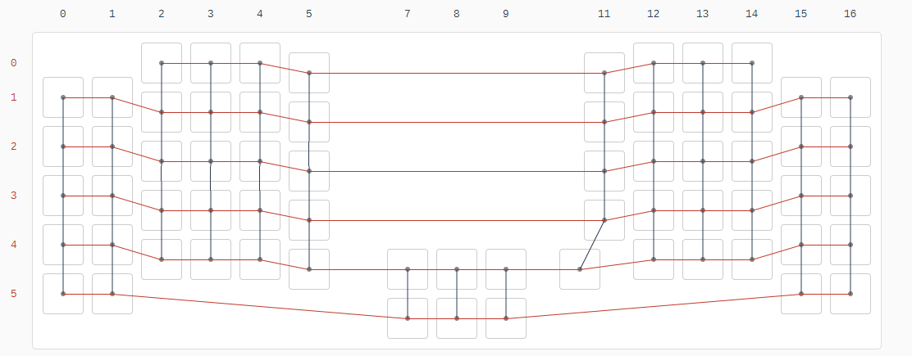
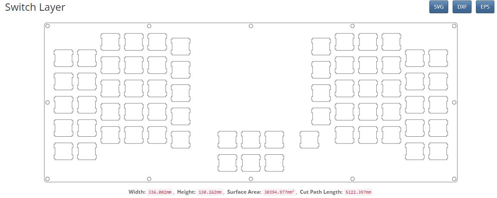
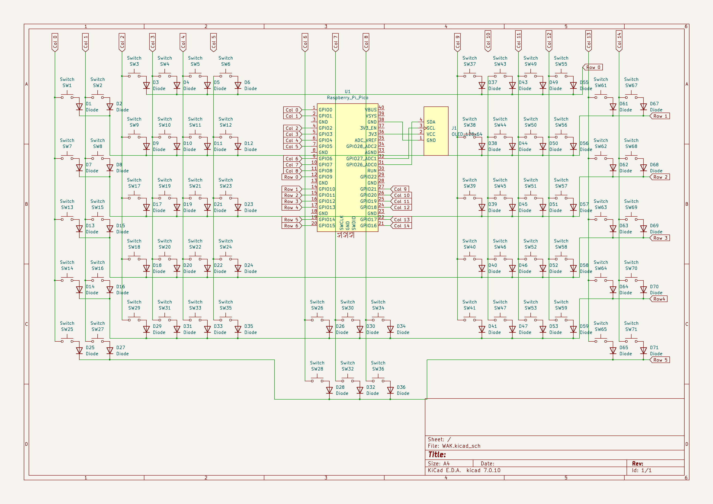
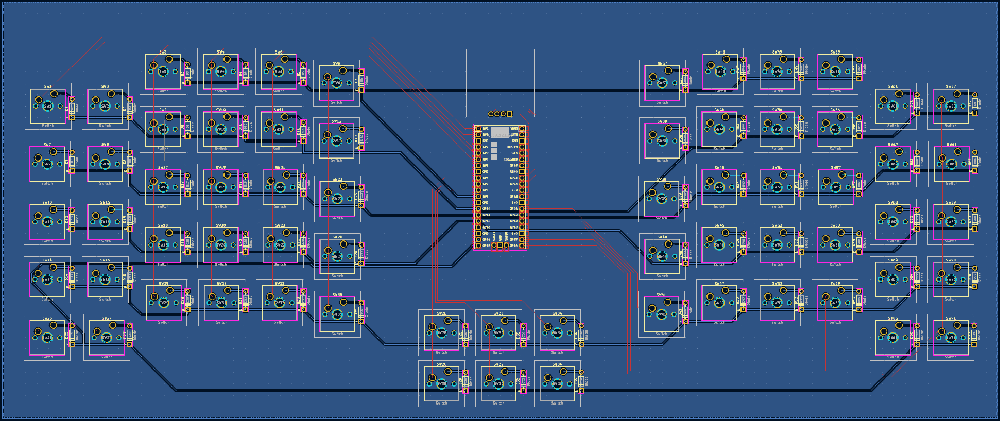

# WAK!

Whilst waiting for a replacement for a beautiful split keyboard, the Sofle v2, i jumped into the rabbit hole of Mechanical Keyboards. It didn't help that my daughter now wants her own, so here I am learning in public.

## Build Diary
[Find my build diary here](diary/diary.md)

## The Board
This will be a handwired, wired (for now) build using an RP2040 board (specifically this one [Waveshare RP2040 Plus](https://thepihut.com/products/rp2040-plus?variant=42405935612099), however if that doesn't work out then I have a Pi Pico WH in waiting--which I need to figure out how to hook up to a LiPo) programmed with KMK. For me this makes sense as i'm primarily a Python developer and KMK is built for the RP2040 ecosystem.

## Inspiration
### My Daughter (actual daughter, not a keyboard)
Wanted a "One piece" keyboard, apparently my split board was toooo space ship like... pfft.

### Lumberjack keyboard
I found this very early on in my search across the web, the one piece "split" with the controller in the middle looks pretty cool.

### Sofle v2
Of course, it's cool. I've tried to keep a similar-ish column stagger (more aggresive pinky, and no ring finger stagger). However, i've moved the clusters into the centre of the board ( something I may live to regret, but hey ho ).

## Design

I've designed this board using [Keyboard Layout Editor](http://www.keyboard-layout-editor.com/), writing it all in their raw data json field _before_ realising that there was GUI the whole time. This produces the contents of this file: [layout.json](data/layout.json).
.png)

Copy Pasting this into [KBFirmware](https://kbfirmware.com/), which I know is EOL but it's great for getting a quick and easy wiring diagram.

Pasting it into [swillkb's builder app](http://builder.swillkb.com/) will generate some CAD output too. Saved in the cad folder. This looks something like this:

I went to [laserboost](https://www.laserboost.com/en/create) to get the switch and bottom plate cut in Aluminium (This is only a prototype, and I feel like I should have found a 3d printer service too... lessons for the future)

I then thought, hmm... what would make this look very professional? People on the Reddit and the YouTube seem to like KiCad, so I gave it a go and came up with this:

I also used this and the ScottoKeebs KiCad repo to generate a PCB, which I will not be getting printed as it is not completed (Some of the lines couldn't route to their pin so I temporarily gave up) and looks trash (from my currently uneducated gaze). It's more here to show it's easy to do after a 3rd viewing of Joe Scotto's tutorial. Look's cool though right?

## Bill Of Materials

My new years resolution is no Amazon so my BoM so far is:

| Item | Cost | Use | Links | Notes |
|---|---|---|---|---|
| Diodes | £3.00 | For Dioding | [Mechboards.co.uk](https://mechboards.co.uk/collections/diodes/products/throughhole-diodes) | |
| MX Silent Reds | £36.00 | The switches | [Mechboards.co.uk](https://mechboards.co.uk/products/cherry-mx-silent-red?variant=41880305172685_) | Being swapped out for Gateron Oil Kings in my Sofle V2, they were on a 25% sale Bargin! |
| Main Header set for Pico * 2| £2.00 | for socketing | [PiHut](https://thepihut.com/products/male-headers-for-raspberry-pi-pico?variant=37979561001155) | *2 so i have a spare, fat fingers and tiny electronics don't go will together | 
| Pin breakout board | £4.20 | For use as my Socket | [PiHut](https://thepihut.com/products/pin-breakout-for-the-raspberry-pi-pico?variant=41952340508867) |Better than hotgluing header sets |
| Mounting Kit (screws and nut) | £11.50 | Screwing everything together | [PiHut](https://thepihut.com/products/mounting-kit-screws-and-nuts?variant=27740827601) ||
| Waveshare RP2040Plus 16MB | £11.80 | The microcontroller | [PiHut](https://thepihut.com/products/rp2040-plus?variant=42405935612099) | Only for a wired build |
| Solder Wire (lead free) | £8.00 | For soldering | [PiHut](https://thepihut.com/products/solder-wire-sac305-rohs-lead-free-0-5mm-02-diameter?variant=27739691025) ||
| USB-C to USB-C cable | £4.50 | To connect to the PC | [PiHut](https://thepihut.com/products/usb-c-to-usb-c-cable-1m?variant=42520365596867) ||
| Fermion Monochrome 128x32 I2C OLED | £9.80 | For visually checking you layer and adding images | [PiHut](https://thepihut.com/products/fermion-monochrome-0-91-128x32-i2c-oled-display-with-chip-pad?variant=42046348394691) | Dont hold the pins to the back of this for testing, you will slowly burn...|
| Metal plates | £70.00 | The case for the whole thing | [Lasterboost](https://www.laserboost.com/en/create) | I only got the switch and bottom plate, but really I should have just gone for a 3D printer service for this prototype |
| Wire | £8.00 | 60m of wire | [modellinglectronics](https://www.modellingelectronics.co.uk/products/solid-connecting-wire-1-0.6mm/) | 6 colours, 10m each not bad. Means I can have colour coded rows and columns for each area |
| Time spent researching | Priceless | So much stuff! | Reddit and Forums | Just so much... |

So far that is **£168.80**

Which I don't think is too bad, and could be brought under £100 by 3D printing the case or using smaller cheaper microcontroller.

I already have a soldering iron, but that was £20-ish and a Dremel for engraving and metal work, £100 but not needed at all.