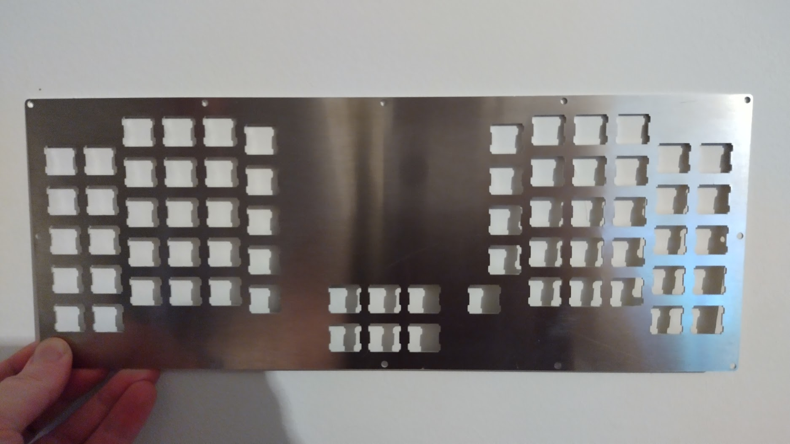
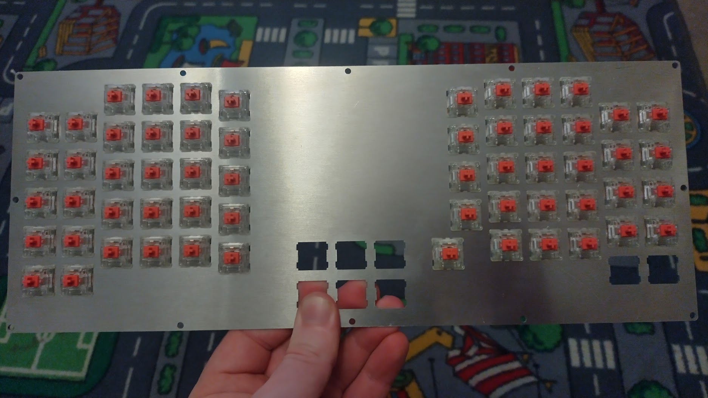
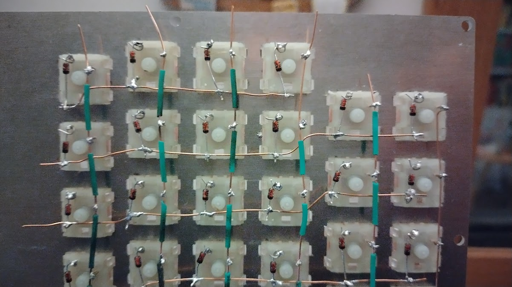
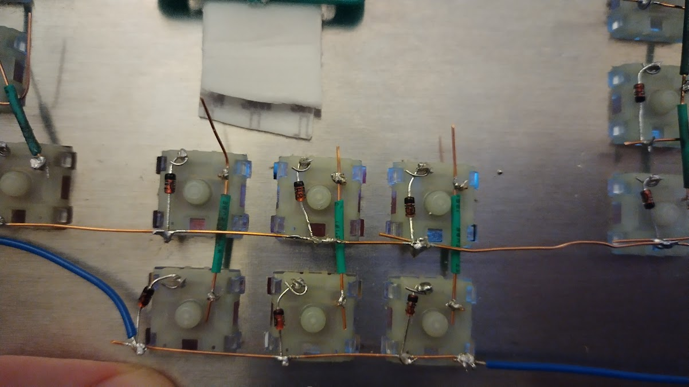
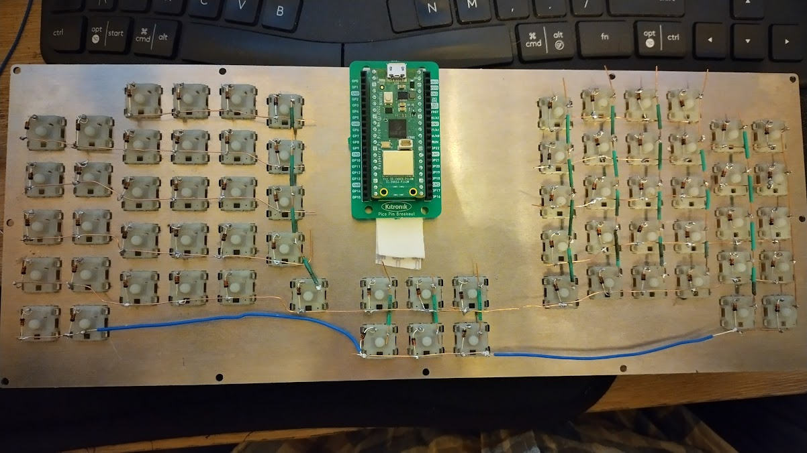
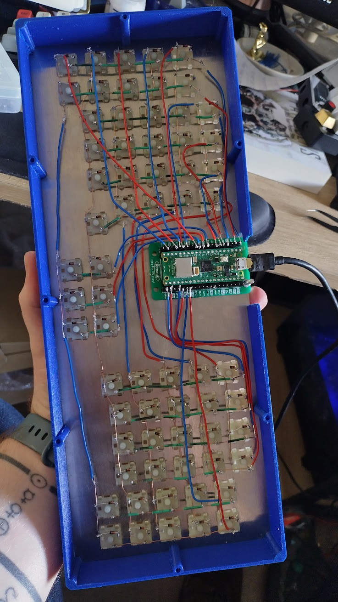
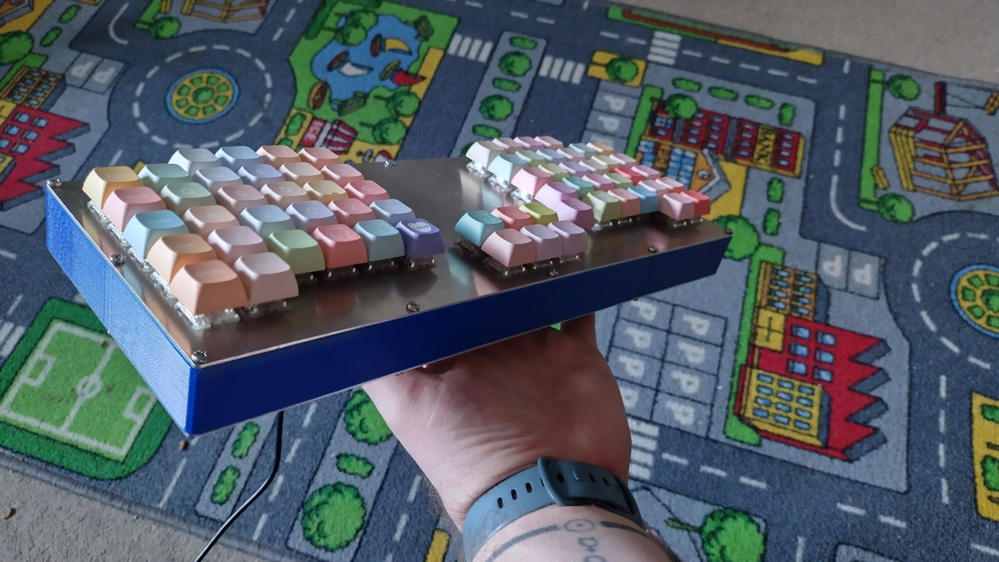
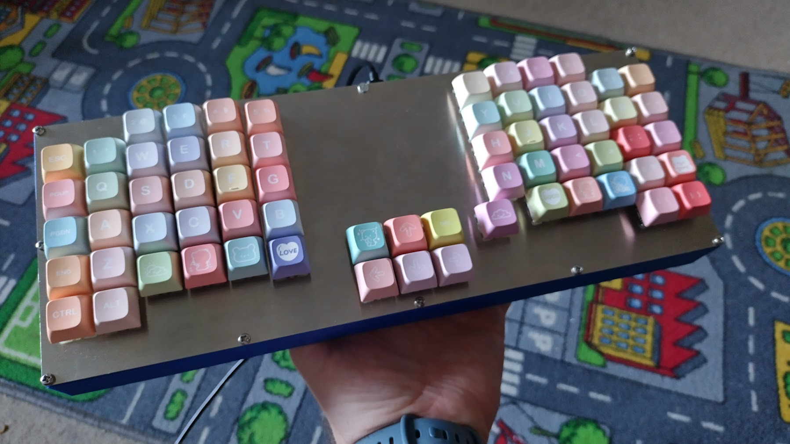

# 24th January 2024 (Day 1)
My PiHut order arrived!

I plugged my Waveshare RP2040 Plus and Raspberry Pi Pico into a mounting board and then into my computer, whilst pressing the bootslct button.

Now follow [this link](https://kmkfw.io/docs/Getting_Started/#tldr-quick-start-guide) on KMK to get started or if your too lazy...

- Downloaded the latest circuit python UF2 file and dropped it into the Pi's. Reboot by pressing the reset button or just re-plugging the device.

- Now download the kmk repo and drop the `kmk` folder and `boot.py` into the the Pi.

- Create a `code.py` or `main.py` in the top level directoy (where boot.py is) and add the following code:

```python
print("Starting")

import board

from kmk.kmk_keyboard import KMKKeyboard
from kmk.keys import KC
from kmk.scanners import DiodeOrientation

keyboard = KMKKeyboard()

keyboard.col_pins = (board.GP0,)
keyboard.row_pins = (board.GP1,)
keyboard.diode_orientation = DiodeOrientation.COL2ROW

keyboard.keymap = [
    [KC.A,]
]

if __name__ == '__main__':
    keyboard.go()
```

You may have to addapt the GP0 and GP1 to your board, these are the General Programmable pins, so don't assume they just mean pin and include ground pins.

_Viola_ 

Reset/boot your pi and use something to bridge GP0 and GP01, I had a jumper wire but you can use a paperclip too. Don't worry if the pi still comes up as an accessible drive, it will still work as a keyboard. Scratched my head for a while before just trying the pins and figuring I had done it right.

Once I got that work, I wrote the first version of my keymap ([found here](data/code_v1.py)) which only took some minor debugging before I found that KC.9 should have been KC.N9, any error will cause it to straight up not work.

And now I wait for everything else to turn up...

# 26th January 2024 (Day 2)

The switch and bottom plates, switches, diodes and wire have arrived!

The plates look great, and I have immediately populated it with _some_ help from my daughter (6 switches rushed into place) before realising I was 6 switches short, so off to mechboards again...

It's a good thing this is a handwired board because those switches wouldn't be coming out even if they wanted to.

Apologies for the shody photots.




6 switches off though...

I then spent the next half hour using these sausage finger to bend all my diodes in preparation for soldering day.

# 27th January 2024 (Day 3)
I tried prepping the wire, cutting the blue wire into strips suitable for the columns, however cutting out the sections for the soldering was pretty difficult. For that reason i'm going to follow Joe Scotto's lead and get my self some bare and larger wire with heat shrink. That will hopefully make life significantly easier.

# 28th January 2024 (Day 4)
New wire has arrived, the heat shrink just about holds onto it when shrunk. It is alot more flammable than i thought though, so when using a naked flame make sure to be significantly above the the flame.

Next time, get some significantly fatter wire, trying to solder lengths of wire which move just to inconvenience you is pretty annoying.

I now started wiring the matrix and damn does it take some time.

# 30th January 2024 (Day 5)
The final switches have arrived and I've now finished the rows and started on the columns with now look something like this (excuse the soldering, it's been 12 years since my last failed attempt).



And now it has suddenly dawned on me i've programmed the matrix backwards... I've done it as i look down on the back side of the board so left side QWERTY is actually right side YTREWQ. At least that is an east fix unlike the 8 backwards diodes I found!!!



Make this be a lesson, always double check the diode direction! I rushed it because the last of the switches finally arrived. But damn is this going to be a pain.

In good news, i have some jumper wire from older projects with raspberry pi's. I hooked up column 3,4,5,6 and row 3 and, after alot of head bashing with the waveshare (which suddenly doesn't work) and a quick replacement with a raspberry pi pico, it works! Never have I been so happy so see `sdfg` get printed out.

Next, it is finishing the columns, swapping out the diodes and then finally running the rowns and columns to some headers that can go into the pinout board.



Yes that is 3M vecro hanging stuff, I had it laying around and for a prototype it ain't too bad. although, it and the Pi now ensures that at least the far end of the board will be about 0.8 inches thick and i've been told I'm not allowed to mount it on the top of the board as the black space **will** be engraved with a rainbow/heart or something equally cute. Orders are orders. So we are now looking at a sloped design.

My daughter has already designed v2 though. Using a rainbow GPIO extender and *shock* a split style board. So that will be pretty fun. I'm thinking of having it so that the gpio can be disconnected easily from the top to turn it into a game pad or be swapped out for other gpio cables (wouldn't it be cool if you could get custom ones... or at least a sleave).

# 1st February 2024 (Day 6)
It is done! 
I can't believe how long soldering can take.... but i'm going to end up doing more of this. Designing and making your own keyboard is quite a rush?!

I've soldered the diodes ( one i did twice as i resoldered the new one on upside down and didn't realise for 20 mins).

It took 2.5 hours soldering everything today (+ the 2 hours on previous days) and then another 1.5 hours of troubleshooting and re-soldering dodgey bit, which would immediately make the whole row work ( an absolute chef's kiss ).

So I started will connecting the two halfs together and then the columns:


Please don't judge the stripy nature of the pattern I went with. I thought it would be helpful and I ran out of colours to do what I wanted.

Next the rows, and the troubleshooting:


Troubleshooting, as said earlier, was fixed dodgey soldering and dodgey code. It turned out that one line had not enough keycodes, causing all the keys to get shifted 2 to the left which made it look as though the bottom row didn't work at all this was after re-soldering the whole row and then realising my mistake.

It may look horrific to a pro, but damn am I proud of it.

Now to pick my kid up from school, take her to the hadware shop and get some inch long m3's before convincing her to give me a final*5 design she wants etched onto the front. And then explain that her keycaps won't arrive for another 10 days :|

# 5th February 2024 (Day 5)
It turned out that the place i chose for 3d printing [Surface Scan](https://www.surfacescan.co.uk/) had to close due to everyone getting covid, which must have been a real pain for them, so we had to wait as few extra days. Which is fine, especially as the end product is great! My 3d modeling is quite literally non-existant, I managed to import the bottom plate into Autodesk Fusion and extrude the outline by about an inch ( because of the whole microcontroller _having_ to to internal ). I made sure that the walls were all obout 1.5mm thick for rigidity and presto.

Once it arrived, I had to do some artistic restructuring... e.g. i cut out a chunk which turned out be to be fair chunk. If I was just more patient then i could have actually measured the cut out and modelled it properly, however, i'm impatient and my boss (a 6yr old) is even less so.

It also turned out that the screw holes where perfect for the M3 screws to not need any nut. Bonus.

The final product, including the cut out:


Also, say what you will about my wire pattern but it has actually helped me fund issues.... issues caused by myself but issues none the less. I dropped it and re-soldered a red wire to GND. It wasn't until testing I realised that the wires were red, red, blue instead of alternating. Fixed in a jiffy.

Ultimately we ended up with this:


An inch thicc aluminium and 3d printed case, MX silent red switches with jelly baby keycaps from Etsy.


